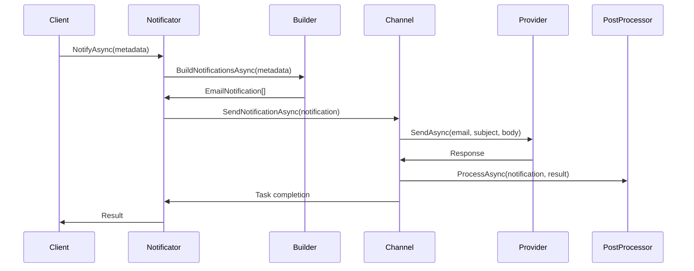

# Email Notifications

The Email notification channel (`EmailNotificationChannel`) provides reliable email delivery using the Curiosity.EMail infrastructure with queued processing, post-processing capabilities, and comprehensive error handling.

## How it works

### Architecture

The email notification system consists of:

1. **EmailNotificationChannel** - Background service that processes email notifications from a queue
2. **EmailNotification** - Represents an email to be sent with subject, body, recipient, and optional parameters
3. **EmailNotificationBuilderBase** - Abstract base class for building email notifications from metadata
4. **IEMailNotificationPostProcessor** - Interface for post-processing after email sending

### Processing Flow



### Queue Processing

- Each `EmailNotificationChannel` processes notifications sequentially
- Uses `BlockingCollection<NotificationQueueItem<EmailNotification>>` for thread-safe queuing
- Provides `TaskCompletionSource` for async completion tracking
- Handles cancellation and shutdown gracefully

### Email Structure

```csharp
public class EmailNotification : INotification
{
    public string ChannelType => "curiosity.notifications.email";
    public string Email { get; }          // Recipient email address
    public string Subject { get; }        // Email subject
    public string Body { get; }           // Email body content
    public bool IsBodyHtml { get; }       // Whether body is HTML
    public IEMailExtraParams? ExtraParams { get; } // Provider-specific parameters
}
```

## Available providers

The email notification channel uses the `IEMailSender` interface from Curiosity.EMail package, which supports multiple providers:

### Mailgun
```csharp
services.AddCuriosityMailgunSender(options =>
{
    options.ApiKey = "your-api-key";
    options.Domain = "your-domain.com";
    options.FromEmail = "noreply@your-domain.com";
});
```

### SendGrid
```csharp
services.AddCuriositySendGridSender(options =>
{
    options.ApiKey = "your-api-key";
    options.FromEmail = "noreply@your-domain.com";
    options.FromName = "Your App Name";
});
```

### SMTP
```csharp
services.AddCuriositySmtpSender(options =>
{
    options.Host = "smtp.your-provider.com";
    options.Port = 587;
    options.Username = "your-username";
    options.Password = "your-password";
    options.EnableSsl = true;
});
```

### In-Memory (Testing)
```csharp
services.AddCuriosityInMemoryEMailSender();
```

## How to add custom provider?

### Step 1: Implement IEMailSender

```csharp
public class CustomEmailSender : IEMailSender
{
    public async Task<Response> SendAsync(
        string email, 
        string subject, 
        string body, 
        bool isBodyHtml = false, 
        CancellationToken cancellationToken = default)
    {
        try
        {
            // Your custom email sending logic here
            await SendEmailThroughCustomProvider(email, subject, body, isBodyHtml);
            
            return Response.Successful();
        }
        catch (AuthenticationException ex)
        {
            return Response.Failed(new Error((int)EmailError.Auth, ex.Message));
        }
        catch (RateLimitException ex)
        {
            return Response.Failed(new Error((int)EmailError.RateLimit, ex.Message));
        }
        catch (Exception ex)
        {
            return Response.Failed(new Error((int)EmailError.Unknown, ex.Message));
        }
    }

    public async Task<Response> SendAsync(
        string email, 
        string subject, 
        string body, 
        bool isBodyHtml, 
        IEMailExtraParams extraParams, 
        CancellationToken cancellationToken = default)
    {
        // Handle extra parameters specific to your provider
        var customParams = extraParams as CustomEmailExtraParams;
        
        // Implementation with extra parameters
        return await SendAsync(email, subject, body, isBodyHtml, cancellationToken);
    }
}
```

### Step 2: Create Custom Extra Parameters (Optional)

```csharp
public class CustomEmailExtraParams : IEMailExtraParams
{
    public string Priority { get; set; } = "normal";
    public string Category { get; set; }
    public Dictionary<string, string> Tags { get; set; } = new();
}
```

### Step 3: Register in IoC

```csharp
public static class IoCExtensions
{
    public static IServiceCollection AddCustomEmailSender(
        this IServiceCollection services,
        Action<CustomEmailOptions> configure)
    {
        services.Configure(configure);
        services.AddSingleton<IEMailSender, CustomEmailSender>();
        return services;
    }
}
```

### Step 4: Configure and Use

```csharp
// In Startup.cs or Program.cs
services.AddCustomEmailSender(options =>
{
    options.ApiEndpoint = "https://api.customprovider.com/email";
    options.ApiKey = "your-api-key";
});

services.AddCuriosityEMailChannel();
```

### Step 5: Create Custom Builder (Optional)

```csharp
public class CustomEmailNotificationBuilder : EmailNotificationBuilderBase<YourNotificationMetadata>
{
    protected override async Task<IReadOnlyList<EmailNotification>> BuildNotificationsAsync(
        YourNotificationMetadata metadata, 
        CancellationToken cancellationToken = default)
    {
        var extraParams = new CustomEmailExtraParams
        {
            Priority = "high",
            Category = "user-notifications",
            Tags = new Dictionary<string, string> { { "user-id", metadata.UserId } }
        };

        var notification = new EmailNotification(
            metadata.RecipientEmail,
            await GenerateSubject(metadata),
            await GenerateBody(metadata),
            isBodyHtml: true,
            extraParams: extraParams
        );

        return new[] { notification };
    }
}
```

## Error Handling

The email channel maps provider errors to standardized notification error codes:

```csharp
var notificationCode = errorCode switch
{
    EmailError.Auth => NotificationErrorCode.Auth,
    EmailError.Communication => NotificationErrorCode.Communication,
    EmailError.RateLimit => NotificationErrorCode.RateLimit,
    EmailError.NoMoney => NotificationErrorCode.NoMoney,
    EmailError.IncorrectRequestData => NotificationErrorCode.IncorrectRequestData,
    _ => NotificationErrorCode.Unknown,
};
```

## Post-Processing

Implement `IEMailNotificationPostProcessor` for actions after email sending:

```csharp
public class EmailAnalyticsProcessor : IEMailNotificationPostProcessor
{
    public async Task ProcessAsync(
        EmailNotification notification, 
        Response result, 
        CancellationToken cancellationToken = default)
    {
        // Log analytics, update database, send webhooks, etc.
        await analyticsService.TrackEmailSent(new EmailAnalytics
        {
            Recipient = notification.Email,
            Subject = notification.Subject,
            Success = result.IsSuccess,
            ErrorCode = result.Errors?.FirstOrDefault()?.Code,
            SentAt = DateTime.UtcNow
        });
    }
}

// Register in IoC
services.AddEMailNotificationPostProcessor<EmailAnalyticsProcessor>();
```