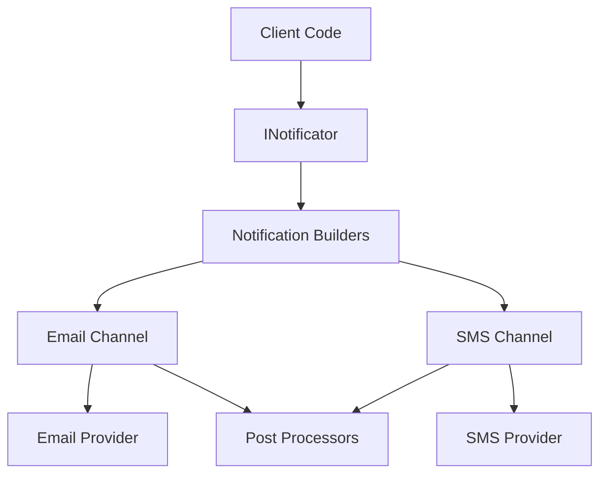

# Notifications

The Curiosity.Notifications subsystem provides a flexible, extensible notification system that supports multiple channels (Email, SMS) with queued processing, reliability features, and post-processing capabilities.

## Architecture Overview

The notification system follows a channel-based architecture where:

- **Notificator** (`INotificator`) - Main service that routes notifications to appropriate channels
- **Notification Channels** (`INotificationChannel`) - Handle actual sending via specific providers (Email, SMS)
- **Notification Builders** (`INotificationBuilder`) - Convert metadata into channel-specific notifications
- **Post Processors** - Handle actions after notification sending (logging, analytics, etc.)



## Key Components

### Notificator
The main service (`Notificator`) that:
- Accepts notification metadata (`INotificationMetadata`)
- Routes to appropriate builders based on notification type
- Manages multiple channels simultaneously
- Provides both synchronous (`NotifyAsync`) and fire-and-forget (`NotifyAndForgot`) methods

### Notification Channels
Background services that:
- Process notifications in a queue (one at a time per channel)
- Handle retries and error management
- Support graceful shutdown with pending notification handling
- Extend `NotificationChannelBase<T>` for implementation

### Notification Builders
Convert metadata into channel-specific notifications:
- Input: `INotificationMetadata` (user-defined)
- Output: `INotification` instances for specific channels
- Allow customization of notification content per channel

## How to Configure

### Basic Setup

```csharp
services.AddCuriosityNotificator();

// Add Email channel
services.AddCuriosityEMailChannel();
services.AddCuriosityEMailSender(); // Configure email provider

// Add SMS channel  
services.AddCuriositySmsChannel();
services.AddCuriositySmsSender(); // Configure SMS provider

// Add notification builders
services.AddCuriosityNotificationBuilder<MyEmailNotificationBuilder>();
services.AddCuriosityNotificationBuilder<MySmsNotificationBuilder>();
```

### Custom Notification Metadata

```csharp
public class UserWelcomeNotification : INotificationMetadata
{
    public string UserEmail { get; set; }
    public string UserName { get; set; }
    public string PhoneNumber { get; set; }
}
```

### Custom Notification Builders

```csharp
public class UserWelcomeEmailBuilder : EmailNotificationBuilderBase<UserWelcomeNotification>
{
    protected override async Task<IReadOnlyList<EmailNotification>> BuildNotificationsAsync(
        UserWelcomeNotification metadata, 
        CancellationToken cancellationToken = default)
    {
        var notification = new EmailNotification(
            metadata.UserEmail,
            "Welcome to our platform!",
            $"Hello {metadata.UserName}, welcome to our platform!",
            isBodyHtml: true
        );
        
        return new[] { notification };
    }
}
```

## Reliability Features

### Queued Processing
- Each channel processes notifications sequentially using `BlockingCollection<T>`
- Prevents overwhelming external services
- Provides backpressure handling

### Error Handling
- Channels catch exceptions and convert to `NotificationException`
- Standardized error codes: `Auth`, `Communication`, `RateLimit`, `NoMoney`, `DeliveryError`
- Failed notifications bubble up to caller with detailed error information

### Graceful Shutdown
- Channels implement `IHostedService` for proper lifecycle management
- Pending notifications are processed or cancelled during shutdown
- `TaskCompletionSource` ensures calling code receives proper completion/cancellation

### Post-Processing
- Email: `IEMailNotificationPostProcessor`
- SMS: `ISmsNotificationPostProcessor`
- Execute after successful/failed sending
- Common uses: logging, analytics, retry logic, user feedback

## Processing Results

### Synchronous Processing
```csharp
try
{
    await notificator.NotifyAsync(new UserWelcomeNotification
    {
        UserEmail = "user@example.com",
        UserName = "John Doe",
        PhoneNumber = "+1234567890"
    });
    // All channels completed successfully
}
catch (NotificationException ex)
{
    // Handle notification-specific errors
    switch (ex.ErrorCode)
    {
        case NotificationErrorCode.Auth:
            // Handle authentication errors
            break;
        case NotificationErrorCode.RateLimit:
            // Handle rate limiting
            break;
        // ... other error types
    }
}
```

### Fire-and-Forget Processing
```csharp
// Does not wait for completion, errors are logged
notificator.NotifyAndForgot(new UserWelcomeNotification
{
    UserEmail = "user@example.com",
    UserName = "John Doe"
});
```

### Result Handling
- Successful notifications complete without exceptions
- Failed notifications throw `NotificationException` with specific error codes
- Post-processors receive both notification and provider response for analysis
- Logging is integrated throughout the pipeline for monitoring and debugging