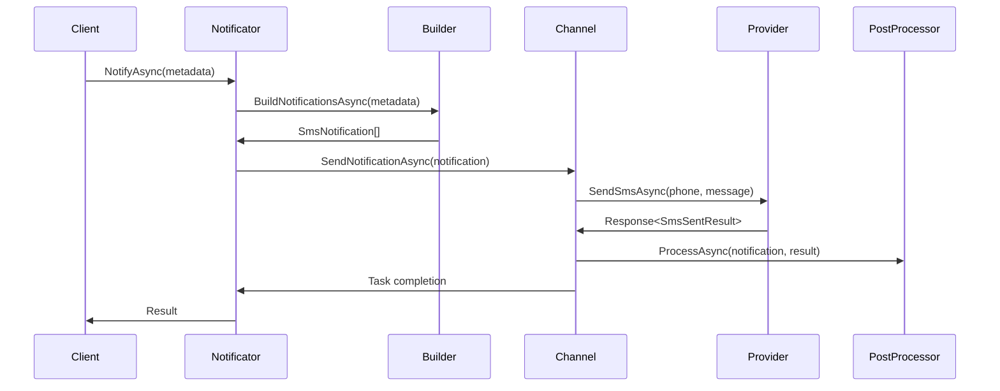

# SMS Notifications

The SMS notification channel (`SmsNotificationChannel`) provides reliable SMS delivery using the Curiosity.SMS infrastructure with queued processing, post-processing capabilities, and comprehensive error handling.

## How it works

### Architecture

The SMS notification system consists of:

1. **SmsNotificationChannel** - Background service that processes SMS notifications from a queue
2. **SmsNotification** - Represents an SMS to be sent with phone number, message, and optional parameters
3. **SmsNotificationBuilderBase** - Abstract base class for building SMS notifications from metadata
4. **ISmsNotificationPostProcessor** - Interface for post-processing after SMS sending

### Processing Flow



### Queue Processing

- Each `SmsNotificationChannel` processes notifications sequentially
- Uses `BlockingCollection<NotificationQueueItem<SmsNotification>>` for thread-safe queuing
- Provides `TaskCompletionSource` for async completion tracking
- Handles cancellation and shutdown gracefully

### SMS Structure

```csharp
public class SmsNotification : INotification
{
    public string ChannelType => "curiosity.notifications.sms";
    public string PhoneNumber { get; }       // Recipient phone number
    public string Message { get; }           // SMS message content
    public ISmsExtraParams? ExtraParams { get; } // Provider-specific parameters
}
```

## Available providers

The SMS notification channel uses the `ISmsSender` interface from Curiosity.SMS package, which supports multiple providers:

### Twilio
```csharp
services.AddCuriosityTwilioSender(options =>
{
    options.AccountSid = "your-account-sid";
    options.AuthToken = "your-auth-token";
    options.FromPhoneNumber = "+1234567890";
});
```

### AWS SNS
```csharp
services.AddCuriosityAwsSnsSender(options =>
{
    options.AccessKey = "your-access-key";
    options.SecretKey = "your-secret-key";
    options.Region = "us-east-1";
});
```

### Nexmo/Vonage
```csharp
services.AddCuriosityNexmoSender(options =>
{
    options.ApiKey = "your-api-key";
    options.ApiSecret = "your-api-secret";
    options.FromNumber = "YourBrand";
});
```

### In-Memory (Testing)
```csharp
services.AddCuriosityInMemorySmsSender();
```

## How to add custom provider?

### Step 1: Implement ISmsSender

```csharp
public class CustomSmsSender : ISmsSender
{
    public async Task<Response<SmsSentResult>> SendSmsAsync(
        string phoneNumber, 
        string message, 
        CancellationToken cancellationToken = default)
    {
        try
        {
            // Your custom SMS sending logic here
            var messageId = await SendSmsViaCustomProvider(phoneNumber, message);
            
            var result = new SmsSentResult
            {
                MessageId = messageId,
                Status = SmsStatus.Sent,
                SentAt = DateTime.UtcNow
            };
            
            return Response<SmsSentResult>.Successful(result);
        }
        catch (AuthenticationException ex)
        {
            return Response<SmsSentResult>.Failed(new Error(1, ex.Message));
        }
        catch (RateLimitException ex)
        {
            return Response<SmsSentResult>.Failed(new Error(4, ex.Message));
        }
        catch (InsufficientFundsException ex)
        {
            return Response<SmsSentResult>.Failed(new Error(5, ex.Message));
        }
        catch (DeliveryException ex)
        {
            return Response<SmsSentResult>.Failed(new Error(6, ex.Message));
        }
        catch (Exception ex)
        {
            return Response<SmsSentResult>.Failed(new Error(0, ex.Message));
        }
    }

    public async Task<Response<SmsSentResult>> SendSmsAsync(
        string phoneNumber, 
        string message, 
        ISmsExtraParams extraParams, 
        CancellationToken cancellationToken = default)
    {
        // Handle extra parameters specific to your provider
        var customParams = extraParams as CustomSmsExtraParams;
        
        // Implementation with extra parameters
        return await SendSmsAsync(phoneNumber, message, cancellationToken);
    }
}
```

### Step 2: Create Custom Extra Parameters (Optional)

```csharp
public class CustomSmsExtraParams : ISmsExtraParams
{
    public string Priority { get; set; } = "normal";
    public string Category { get; set; }
    public DateTime? ScheduledTime { get; set; }
    public Dictionary<string, string> Tags { get; set; } = new();
}
```

### Step 3: Register in IoC

```csharp
public static class IoCExtensions
{
    public static IServiceCollection AddCustomSmsSender(
        this IServiceCollection services,
        Action<CustomSmsOptions> configure)
    {
        services.Configure(configure);
        services.AddSingleton<ISmsSender, CustomSmsSender>();
        return services;
    }
}
```

### Step 4: Configure and Use

```csharp
// In Startup.cs or Program.cs
services.AddCustomSmsSender(options =>
{
    options.ApiEndpoint = "https://api.customprovider.com/sms";
    options.ApiKey = "your-api-key";
});

services.AddCuriositySmsChannel();
```

### Step 5: Create Custom Builder (Optional)

```csharp
public class CustomSmsNotificationBuilder : SmsNotificationBuilderBase<YourNotificationMetadata>
{
    protected override async Task<IReadOnlyList<SmsNotification>> BuildNotificationsAsync(
        YourNotificationMetadata metadata, 
        CancellationToken cancellationToken = default)
    {
        var extraParams = new CustomSmsExtraParams
        {
            Priority = "high",
            Category = "user-notifications",
            Tags = new Dictionary<string, string> { { "user-id", metadata.UserId } }
        };

        var notification = new SmsNotification(
            metadata.PhoneNumber,
            await GenerateMessage(metadata),
            extraParams
        );

        return new[] { notification };
    }
}
```

## Error Handling

The SMS channel maps provider errors to standardized notification error codes:

```csharp
var notificationCode = error.Code switch
{
    1 => NotificationErrorCode.Auth,           // Authentication error
    2 => NotificationErrorCode.Communication,  // Communication error
    4 => NotificationErrorCode.RateLimit,      // Rate limit exceeded
    5 => NotificationErrorCode.NoMoney,        // Insufficient funds
    6 => NotificationErrorCode.DeliveryError,  // Delivery failure
    _ => NotificationErrorCode.Unknown,        // Unknown error
};
```

## Post-Processing

Implement `ISmsNotificationPostProcessor` for actions after SMS sending:

```csharp
public class SmsAnalyticsProcessor : ISmsNotificationPostProcessor
{
    public async Task ProcessAsync(
        SmsNotification notification, 
        Response<SmsSentResult> result, 
        CancellationToken cancellationToken = default)
    {
        // Log analytics, update database, send webhooks, etc.
        await analyticsService.TrackSmsSent(new SmsAnalytics
        {
            PhoneNumber = notification.PhoneNumber,
            Message = notification.Message,
            Success = result.IsSuccess,
            MessageId = result.Data?.MessageId,
            ErrorCode = result.Errors?.FirstOrDefault()?.Code,
            SentAt = DateTime.UtcNow
        });
    }
}

// Register in IoC
services.AddSmsNotificationPostProcessor<SmsAnalyticsProcessor>();
```

## Common Usage Patterns

### Two-Factor Authentication
```csharp
public class TwoFactorSmsBuilder : SmsNotificationBuilderBase<TwoFactorMetadata>
{
    protected override async Task<IReadOnlyList<SmsNotification>> BuildNotificationsAsync(
        TwoFactorMetadata metadata, 
        CancellationToken cancellationToken = default)
    {
        var message = $"Your verification code is: {metadata.Code}. Do not share this code.";
        
        var notification = new SmsNotification(
            metadata.PhoneNumber,
            message
        );

        return new[] { notification };
    }
}
```

### Order Status Updates
```csharp
public class OrderStatusSmsBuilder : SmsNotificationBuilderBase<OrderStatusMetadata>
{
    protected override async Task<IReadOnlyList<SmsNotification>> BuildNotificationsAsync(
        OrderStatusMetadata metadata, 
        CancellationToken cancellationToken = default)
    {
        var message = metadata.Status switch
        {
            OrderStatus.Confirmed => $"Order #{metadata.OrderNumber} confirmed. Estimated delivery: {metadata.EstimatedDelivery:d}",
            OrderStatus.Shipped => $"Order #{metadata.OrderNumber} shipped. Tracking: {metadata.TrackingNumber}",
            OrderStatus.Delivered => $"Order #{metadata.OrderNumber} delivered. Thank you for your purchase!",
            _ => $"Order #{metadata.OrderNumber} status updated to {metadata.Status}"
        };
        
        var notification = new SmsNotification(
            metadata.CustomerPhone,
            message
        );

        return new[] { notification };
    }
}
```

### International SMS Considerations
```csharp
public class InternationalSmsBuilder : SmsNotificationBuilderBase<InternationalNotificationMetadata>
{
    protected override async Task<IReadOnlyList<SmsNotification>> BuildNotificationsAsync(
        InternationalNotificationMetadata metadata, 
        CancellationToken cancellationToken = default)
    {
        // Format phone number with country code
        var formattedPhone = FormatPhoneNumber(metadata.PhoneNumber, metadata.CountryCode);
        
        // Localize message based on country
        var message = await GetLocalizedMessage(metadata.MessageKey, metadata.CountryCode);
        
        var extraParams = new CustomSmsExtraParams
        {
            Priority = "normal",
            Category = "international",
            Tags = new Dictionary<string, string> 
            { 
                { "country", metadata.CountryCode },
                { "language", metadata.Language }
            }
        };
        
        var notification = new SmsNotification(
            formattedPhone,
            message,
            extraParams
        );

        return new[] { notification };
    }
}
```